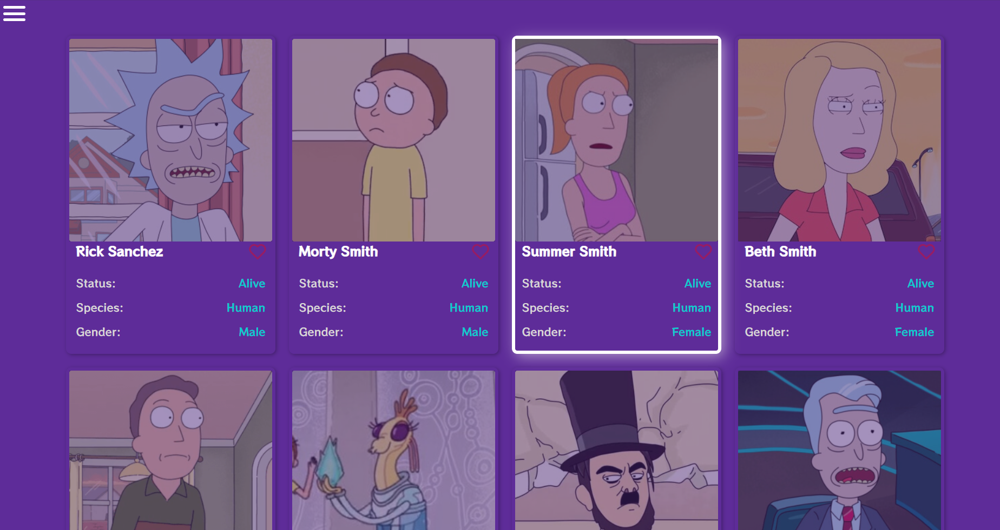
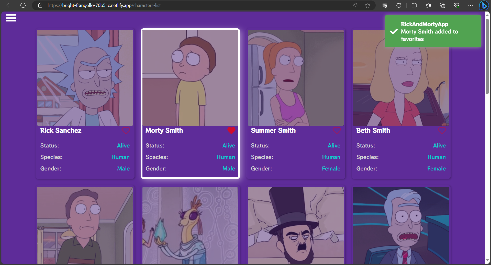
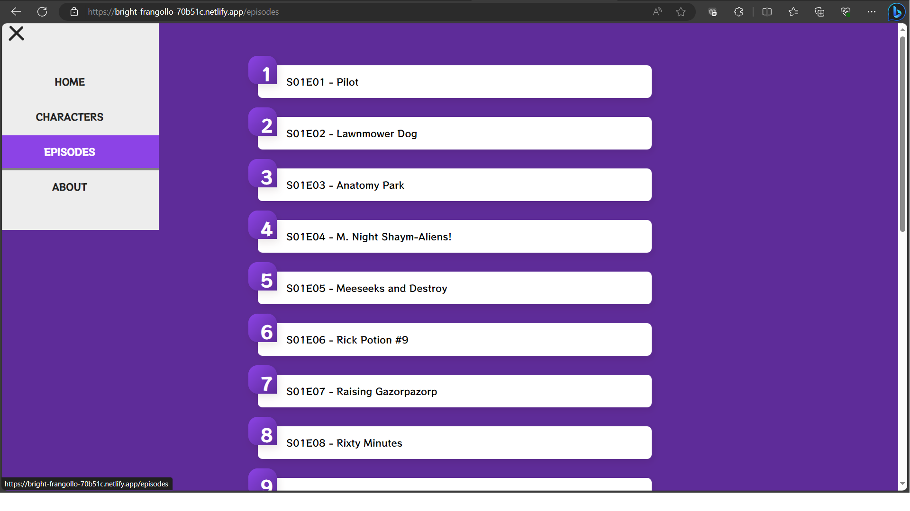

# Rick and Morty Angular App



This is a sample project that uses Angular to display information about the "Rick and Morty" TV series. The project utilizes the public [Rick and Morty API](https://rickandmortyapi.com/).

## Screenshots




## Features

-   List of "Rick and Morty" characters.
-   Character details, including status, species, gender, and more..
-   Infinity Scroll.
-   Add or Remove from Favorites.

## Requirements

-   [Node.js](https://nodejs.org/) installed on your system.
-   [Angular CLI](https://cli.angular.io/) installed globally.

## Installation

Follow these steps to install and run the application:

1.  Clone the repository:

    ```bash
    git clone https://github.com/Aanttrax/RickAndMorty-Angular.git
    ```

2.  Navigate to the project directory:

    ```bash
    cd RickAndMorty-Angular
    ````

3. Install the dependencies:

	```bash
    npm install
    ```

4. Start the application:

    ```bash
    ng serve
    ```

5. Open your browser and go to http://localhost:4200/.


## Usage

Once the application is up and running, you can do the following:

- Browse the list of "Rick and Morty" characters.
- Click on a character to view more details.
- Add to Favorites.
- Remove from Favorites.
- Infinity Scroll.

## Contribution

If you want to contribute to this project, feel free to open issues and submit pull requests.

## Contact
You can contact the project author at Arielrt20@gmail.com or Arielrt_@hotmail.com

Enjoy exploring the "Rick and Morty" universe!

